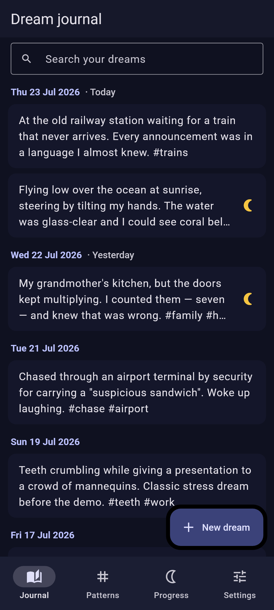
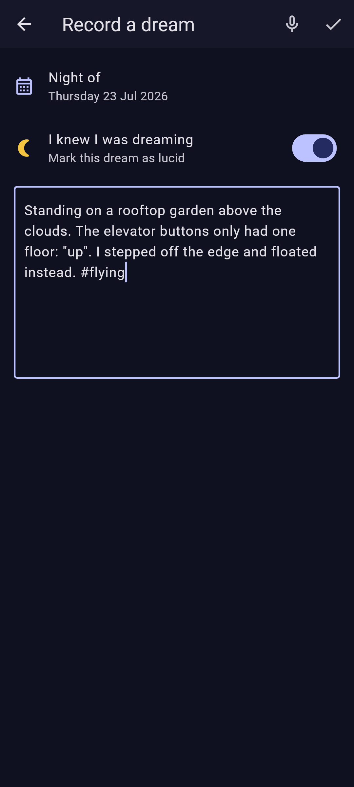
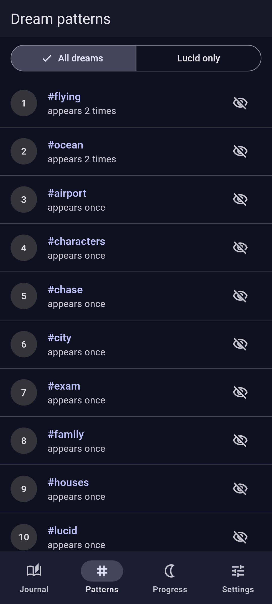
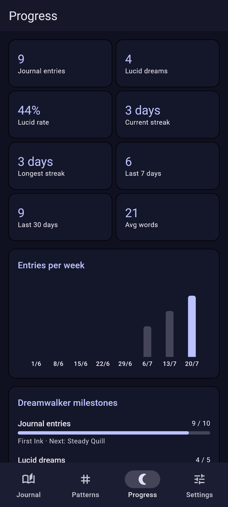
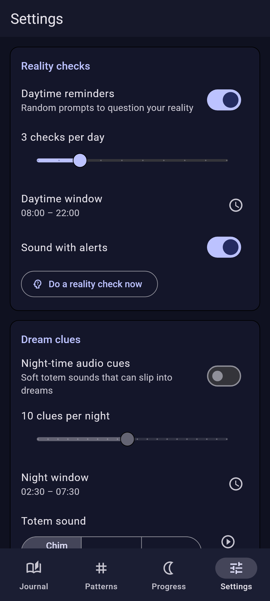

<div align="center">
  

  # Oneiro — a free, open-source dream journal & lucid dreaming trainer

  **Your dreams stay yours.** Local-first, end-to-end encrypted sync, no ads, no accounts.

  [](LICENSE)
</div>

Oneiro is a privacy-first dream journal and lucid dreaming companion for
Android, built with Flutter. It keeps your dreams on your device, and — if you
want backup or multi-device sync — synchronizes them **end-to-end encrypted**
to any WebDAV folder you control (pCloud, Nextcloud, Synology, …) or to a plain
local folder that a sync tool of your choice mirrors.

Oneiro is a clean-room, community-driven alternative to the unmaintained
"Awoken – Lucid Dreaming Tool". It is not affiliated with that app's
developer, contains none of its code or assets, and can import Awoken
journal exports (see below).

## Screenshots

<div align="center">
  <table>
    <tr>
      <td></td>
      <td></td>
      <td></td>
      <td></td>
      <td></td>
    </tr>
    <tr>
      <td align="center"><sub>Journal</sub></td>
      <td align="center"><sub>Editor</sub></td>
      <td align="center"><sub>Patterns</sub></td>
      <td align="center"><sub>Progress</sub></td>
      <td align="center"><sub>Settings</sub></td>
    </tr>
  </table>
</div>

Screenshots are rendered headlessly from the real app by
`tool/screenshots_test.dart` (`flutter test tool/screenshots_test.dart`), so
they never drift far from the actual UI.

## Features

- **Dream journal** — date-organized, full-text searchable entries with
  lucid-dream markers; swipe to delete with undo.
- **Reality-check reminders** — customizable count and daytime window
  (defaults: 3 checks/day between 08:00 and 22:00) with a guided
  reality-check ritual.
- **Dream clues (totem sounds)** — gentle audio cues during a night window
  (defaults: 02:30–07:30) with selectable tones and volume, designed to
  trigger lucidity without waking you.
- **Morning journal reminder** — a silent nudge to capture your dream before
  it fades.
- **Training pause** — pause reminders for 1/3/7 days without losing your
  settings.
- **Dream patterns** — the most frequent themes and #hashtags across your
  journal, with lucid-only filtering and dismissible words.
- **Progress & milestones** — entry streaks, lucid percentage, weekly
  activity chart and achievement tracks for journaling, lucidity, reality
  checks and dream clues.
- **Dictation** — record your dream by voice right from the editor.
- **PIN lock** — optional app lock with scrypt-hashed PIN (never stored in
  plaintext) and lockout cooldown.
- **Backup & import** — import Awoken `.txt` exports; export your journal in
  the same plain-text format (stay compatible) or as full-fidelity JSON.
- **Encrypted sync ("OVault")** — zero-knowledge sync: AES-256-GCM per entry,
  scrypt-derived key from your passphrase, last-write-wins replication with
  tombstones. WebDAV or local folder. See
  [docs/sync-format.md](docs/sync-format.md) for the full specification and an
  honest threat model. **OVault is not Cryptomator-compatible** — it follows
  the same client-side-encryption philosophy with a simpler, documented
  format.
- **Dark & light theme**, Material 3.

No ads. No accounts. No analytics. No paywalls.

## Getting the app

Release APKs will be published on the GitHub Releases page. Building from
source is easy (below).

## Building from source

Prerequisites: [Flutter SDK](https://docs.flutter.dev/get-started/install)
(stable; developed against 3.32) and, for APK builds, the Android SDK
(Android Studio).

```bash
git clone <your-fork-url>
cd oneiro
flutter pub get
flutter pub run build_runner build --delete-conflicting-outputs   # drift codegen (first time / after schema changes)
flutter analyze        # static checks
flutter test           # 200+ unit & widget tests
flutter build apk --release
```

Optional: regenerate launcher icons after changing `assets/icon/` with
`dart run flutter_launcher_icons`. Ready to publish? Follow
[docs/release-checklist.md](docs/release-checklist.md) — signing, GitHub
releases and F-Droid metadata are already wired up.

### Verifying the Awoken importer against a real export

A dedicated test is skipped unless pointed at a real export file:

```bash
AWOKEN_EXPORT_PATH=/path/to/"Awoken Dream Export.txt" flutter test test/features/backup/awoken_real_file_test.dart
```

## Using encrypted sync

1. In **Settings → Encrypted Sync**, choose **WebDAV** (e.g. pCloud:
   `https://webdav.pcloud.com`) or **Local folder**.
2. Enter your credentials (the WebDAV password is stored only in the
   Android Keystore-backed credential vault, never in the app database).
3. Choose a strong **vault passphrase**. It never leaves the device; the key
   is derived from it with scrypt. **If you lose it, the remote data is
   unrecoverable** — there is no password reset by design.
4. Tap **Sync now**. On a second device, configure the same location and
   unlock with the same passphrase.

## Architecture

Feature-first layering (`lib/src/<feature>/{domain,data,presentation}`),
Riverpod for state/DI, drift (SQLite) for persistence, go_router for
navigation. All plugin-facing code (notifications, audio, speech, secure
storage, WebDAV) hides behind interfaces with in-memory fakes, which keeps
~200 tests fast and device-free. See [docs/ARCHITECTURE.md](docs/ARCHITECTURE.md)
and [docs/backup-format.md](docs/backup-format.md).

## Privacy

Oneiro processes everything on your device. The journal database is local;
sync is optional and end-to-end encrypted. There are no third-party
analytics, ads or tracking of any kind.

## Contributing

Contributions are welcome — see [CONTRIBUTING.md](CONTRIBUTING.md). Please
keep the clean-room rule: never copy code, assets, or text from proprietary
dream apps; functionality and ideas are free, expression is not.

## Legal notes

- Oneiro is an independent, clean-room reimplementation of *functionality*
  popularized by "Awoken – Lucid Dreaming Tool" (Andreas Rudolph). No code,
  text, images, audio or other assets from that app were used. The name is
  referenced only to describe import compatibility (nominative use); Oneiro
  is not affiliated with or endorsed by its developer.
- The plain-text export format Oneiro reads and writes is an undocumented
  data convention, re-implemented for interoperability with users' own
  exported data.
- Totem sounds in `assets/audio/` are original, synthesized for this project
  and released under CC0.
- The launcher icon is original artwork generated by a script in this repo
  (`tools/generate_launcher_icon.py`) and released under the same GPL-3.0
  license as the code. Roboto (used only to render documentation
  screenshots, not shipped in the app) is Apache-2.0 — see
  `tool/fonts/LICENSE.txt`.
- OVault is Oneiro's own format; it is inspired by the client-side
  encryption approach of Cryptomator but shares no code and no
  compatibility with it.

## License

Oneiro is free software: you can redistribute it and/or modify it under the
terms of the **GNU General Public License v3.0** — see [LICENSE](LICENSE).
Third-party packages retain their own (permissive) licenses; see
`flutter pub deps` for the dependency tree.
